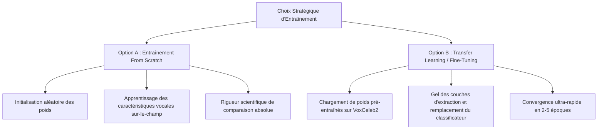

# 📂 Chapitre 6 : Stratégie d'Entraînement des Modèles — From Scratch vs Fine-Tuning

Ce chapitre présente une étude comparative approfondie entre l'entraînement à partir de zéro (**From Scratch**) et l'adaptation de modèles pré-entraînés (**Fine-Tuning** / **Transfer Learning**). Il justifie le choix méthodologique de notre projet de fin d'études (PFA) et fournit un guide technique d'adaptation.

---

## 1. Description des deux approches stratégiques

La conception d'un modèle d'apprentissage profond pour la vérification du locuteur peut suivre deux voies distinctes :



### Option A : Entraînement From Scratch (Configuration Actuelle)
Tous les poids synaptiques du réseau (blocs TDNN, couches Res2Net, pooling attentionnel, et projection AAM-Softmax) sont initialisés de manière aléatoire (par exemple via la méthode de Xavier ou Kaiming). Le modèle doit construire son propre extracteur de caractéristiques (représentations de formants, enveloppe spectrale, caractéristiques prosodiques) uniquement à partir des signaux audio de la base de données d'entraînement.

### Option B : Fine-Tuning (Transfer Learning)
On utilise un réseau pré-entraîné sur un corpus de parole massif (tel que **VoxCeleb2**, comptant plus de 6 000 locuteurs et 1 million d'audios). Ce modèle dispose déjà d'un extracteur de caractéristiques vocales universel et extrêmement robuste. L'entraînement consiste à charger ces poids pré-entraînés, à remplacer le classificateur de sortie par une nouvelle couche adaptée à notre nombre de locuteurs cible ($1111$), puis à mettre à jour l'ensemble des poids avec un taux d'apprentissage très faible.

---

## 2. Avantages et Inconvénients Comparés

### 🏋️‍♂️ Option A : Entraînement From Scratch

#### Avantages :
1.  **Rigueur scientifique et comparaison équitable** : Il s'agit du seul protocole qui garantit une comparaison $100\%$ juste des capacités intrinsèques des architectures X-Vector et ECAPA-TDNN. Si nous utilisions des modèles pré-entraînés issus de SpeechBrain ou d'autres librairies, l'ECAPA-TDNN pourrait surclasser le X-Vector simplement parce que son checkpoint d'origine a été entraîné sur un plus grand jeu de données ou avec des hyperparamètres plus poussés, et non à cause de sa supériorité structurelle.
2.  **Autonomie et indépendance technologique** : L'exécution est autonome et ne dépend pas de serveurs distants ou d'API (comme HuggingFace). C'est un aspect capital pour des conteneurs Kaggle isolés sans connexion internet.
3.  **Valeur pédagogique et académique** : Permet de suivre l'apprentissage depuis une erreur maximale jusqu'à la convergence, d'analyser l'efficacité de la fonction de perte AAM-Softmax et de visualiser l'évolution des représentations spectrales au fil des époques.

#### Inconvénients :
1.  **Coût computationnel élevé** : Nécessite plus de temps de calcul GPU (30 époques sur GPU P100/T4) pour obtenir des taux d'EER bas.
2.  **Sensibilité aux données** : Exige une base d'entraînement de grande taille et diversifiée pour éviter le surapprentissage (overfitting).

---

### 🚀 Option B : Fine-Tuning (Transfer Learning)

#### Avantages :
1.  **Exactitude biométrique supérieure (SOTA)** : Profite d'embeddings vocaux optimisés sur des milliers d'heures de parole. L'EER chute généralement sous les $1\%$ à $2\%$ presque instantanément.
2.  **Convergence ultra-rapide** : L'adaptation de l'extracteur de caractéristiques au jeu de données cible ne demande que **2 à 5 époques**, ce qui permet d'économiser près de $90\%$ de temps de calcul GPU.
3.  **Efficacité sur de petits jeux de données** : Le modèle généralise très bien, même si vous ne disposez que d'une ou deux minutes d'enregistrement par locuteur.

#### Inconvénients :
1.  **Contraintes de connectivité (Kaggle)** : Exige d'importer manuellement les fichiers de poids `.pt` en tant que datasets Kaggle additionnels car l'accès internet est désactivé par défaut dans les sessions de soumission.
2.  **Complexité d'adaptation structurelle** : Nécessite de manipuler les dictionnaires de poids (`state_dict`) pour filtrer et éliminer les anciennes couches de classification avant le chargement des paramètres d'extraction.

---

## 3. Matrice Comparative des Stratégies

| Dimension Métrique | Entraînement From Scratch (Choix PFA) | Fine-Tuning (Transfer Learning) |
| :--- | :--- | :--- |
| **Vitesse de convergence** | 🔴 Lente (30+ époques requises) | 🟢 Ultra-rapide (2 à 5 époques) |
| **EER Biométrique Final** | 🟡 Bon à Très Bon ($4\% - 14\%$) | 🟢 Excellent / Proche de la perfection ($< 1\%$) |
| **Facilité d'usage (Kaggle)**| 🟢 Maximale (Zéro configuration externe) | 🟡 Moyenne (Nécessite l'upload des poids `.pt`) |
| **Équité de comparaison** | 🟢 **Parfaite et Scientifique** | 🟡 Biaisée (Dépendante de la qualité du pré-entraînement) |
| **Coût en heures GPU** | 🟡 Modéré à Élevé | 🟢 Extrêmement Faible |
| **Adaptabilité au domaine** | 🟢 Totale (Apprend sur vos données exactes) | 🟢 Excellente (Par adaptation rapide) |

---

## 4. Recommandation Stratégique pour le Projet de PFA

### **Décision : Maintien de l'Entraînement From Scratch**
Pour un projet académique d'analyse comparative de modèles, **l'entraînement à partir de zéro est la seule méthodologie scientifiquement rigoureuse et validée**. Elle isole les performances de l'architecture réseau de l'influence externe de jeux de données massifs de pré-entraînement.

De plus, notre configuration actuelle est déjà optimisée :
*   L'augmentation dynamique de données via MUSAN à des niveaux de SNR variés (0 à 15 dB) introduit une régularisation acoustique forte, prévenant l'overfitting.
*   L'introduction de la fonction de perte angulaire **AAM-Softmax (ArcFace)** pour le modèle ECAPA-TDNN permet d'accélérer drastiquement la vitesse de structuration de l'espace d'embedding, compensant ainsi la lenteur de convergence habituelle des architectures entraînées *from scratch*.

---

## 5. Guide Technique : Transition vers le Fine-Tuning

Si vous souhaitez dans de futurs travaux adapter le pipeline pour faire du fine-tuning avec un modèle pré-entraîné SpeechBrain sur vos locuteurs, la procédure suivante doit être suivie :

1.  **Téléchargement et import** : Télécharger le checkpoint pré-entraîné d'ECAPA-TDNN au format PyTorch (par exemple depuis HuggingFace SpeechBrain) et l'importer dans Kaggle sous forme de Dataset Privé à l'adresse `/kaggle/input/ecapa-pretrained/best_model.pt`.
2.  **Instanciation du modèle local** : Instancier le modèle localement avec le nombre de classes (locuteurs) correspondant à votre jeu cible.
3.  **Chargement partiel des poids (Partial State-Dict Loading)** :
    Pour éviter une erreur d'incompatibilité de forme (shape mismatch) sur la dernière couche linéaire de classification (qui a été entraînée sur VoxCeleb2 avec 6000 classes alors que votre base locale en contient 1111), les poids de la couche de classification doivent être filtrés.
    Voici le script PyTorch à implémenter :
    
```python
# 1. Instancier l'architecture locale
model = ECAPATDNNModel(input_dim=80, num_classes=1111, embedding_dim=192)

# 2. Charger le checkpoint pré-entraîné
pretrained_checkpoint = torch.load('/kaggle/input/ecapa-pretrained/best_model.pt', map_location=device)
pretrained_dict = pretrained_checkpoint['model_state_dict']

# 3. Filtrer les poids de la couche de classification de sortie
local_dict = model.state_dict()
filtered_dict = {k: v for k, v in pretrained_dict.items() if k in local_dict and 'classifier' not in k}

# 4. Injecter les poids d'extraction et forcer strict=False
local_dict.update(filtered_dict)
model.load_state_dict(local_dict, strict=False)
print("[INFO] Poids d'extraction pré-entraînés chargés. Classificateur réinitialisé.")
```

4.  **Gel des paramètres (Layer Freezing - Optionnel)** :
    Si la base de données cible est très petite, on peut geler l'extracteur de caractéristiques pour ne mettre à jour que le classificateur final :
```python
# Geler l'extracteur
for name, param in model.named_parameters():
    if 'classifier' not in name:
        param.requires_grad = False

# Passer uniquement les paramètres actifs à l'optimiseur
optimizer = optim.AdamW(filter(lambda p: p.requires_grad, model.parameters()), lr=0.001)
```
Cette méthodologie assure une adaptation rapide sans risque de détruire les filtres acoustiques pré-entraînés.
